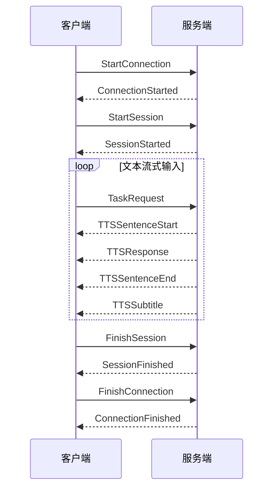

# 豆包 TTS 使用文档

本技能的**默认 TTS**。可直接调用 `scripts/doubao_tts.py`，它自带帧编解码，不需要下载官方 protocols 包。本文后半部分是接口原文，前面是实测要点。

## 实测要点（优先于原文）

1. **凭据**：从环境变量或 `.env` 读取 `APIKEY`（请求头 `X-Api-Key`）和 `VOICE`（`speaker`），`X-Api-Resource-Id` 固定为 `seed-tts-2.0`。
2. **关水印**：`additions` 中显式传入 `"aigc_watermark": false`，关闭结尾节奏标识。
3. **字级时间戳在 `TTSSubtitle` 事件里**，不在 `TTSSentenceEnd`（后者的 `words` 为空数组）。需要开启 `audio_params.enable_subtitle: true`。
4. **时间戳是会话全局时间**：一次请求里有多个分句时，服务端每个分句各发一次 `TTSSubtitle`，时间都从会话开头算起，不需要累加偏移；`TTSSentenceStart` 在整个会话里只出现一次。脚本仍保留判定逻辑，若服务端将来改为句段相对时间，会自动平移并在 `--debug` 中显示。
5. **标点并入前一个字**：`words` 里会出现 `"了！"`、`"个，"` 这样的条目，拼接校验原文或用户要求逐字高亮时，要按字符拆开。
6. **语气指令**：`additions.context_texts: ["……"]` 对语气影响明显，例如“激动兴奋，节奏很快”“压低声音，有点紧张”。复刻音色指定 `model` 后不能使用。
7. **语速**：`speech_rate` 范围 `[-50, 100]`，`10–15` 已经明显偏快，适合节奏紧凑的解说。
8. **音频格式**：脚本以 `pcm`（24 kHz、16bit、单声道）接收，按字节数得到精确时长，再落盘成 WAV 或 MP3。直接收 MP3 时无法可靠计算中途的音频时长。
9. **中英混读**：`explicit_language: "zh-cn"`；设为 `en` 会跳过中文。
10. **错误处理**：鉴权失败、配额不足等不可恢复的错误应立即停止，避免重复计费；网络中断可有限次重试。

## 配置

凭据与音色保存在项目 `.env`：

```text
APIKEY=<火山引擎控制台 → 豆包语音 → API Key 管理>
VOICE=<音色 ID，见 doubao-voices.json>
```

用 `scripts/tts_setup.py` 完成交互式配置（流程见 SKILL.md「语音配置交互」）。`doubao-voices.json` 由官方音色列表（https://www.volcengine.com/docs/6561/1257544 ，2026-09-22 版）解析而来，包含 2.0 中文音色 294 个、外语音色 137 个，字段为场景、名称、ID、语种、能力与标签。官方列表更新后可重新解析。

## 脚本用法

```bash
# 单句试听
python3 <skill-dir>/scripts/doubao_tts.py --text "你好，欢迎来到今天的故事。" --tone "亲切" --out audio/tts --env .env

# 批量：lines.json = [{"id": "c1_01", "text": "……", "tone": "……"}, ...]
python3 <skill-dir>/scripts/doubao_tts.py --lines lines.json --out audio/tts --env .env \
  --tone-default "你是讲故事的主持人，语气自然清晰。" --rate 10 --format mp3

# 只重合成某几句 / 忽略缓存 / 查看时间基准判定
python3 <skill-dir>/scripts/doubao_tts.py --lines lines.json --out audio/tts --only c1_01,c1_02
python3 <skill-dir>/scripts/doubao_tts.py --lines lines.json --out audio/tts --force --debug
```

输出：
- `<out>/<id>.mp3|wav`：每句音频
- `<out>/words.json`：`{id: [{"w","s","e"}]}`，单位为秒，从该句音频开头算起
- `<out>/manifest.json`：每句的输入指纹、时长和文件名；文本、语气、音色、语速或格式改变时自动重新合成

每句都会校验：音频非空、时间戳单调且不超出音频、字幕文字完整覆盖原文。不通过就重试，重试仍失败则以非零退出码结束。

---

# 接口原文

# 豆包 TTS 双向流式接口

基于 WebSocket 的双向流式语音合成。文本可以分片持续送入，音频分片返回，面向实时交互，覆盖多语种与多方言。

> [!info] 接入地址
> `wss://openspeech.bytedance.com/api/v3/tts/bidirection`

二进制帧定义见 [TTS Websocket Bidirection protocols.zip](https://portal.volccdn.com/obj/volcfe/cloud-universal-doc/upload_5ec6e28945592c909158dc1e2cf9a89c.zip)。

## 交互顺序



中途可发 `CancelSession`，对应 `SessionCanceled`。失败事件为 `ConnectionFailed`、`SessionFailed`。`TTSSubtitle` 只在开启字幕后返回。完整收发过程见 [[#调用示例]]。

## 请求头

| 请求头 | 类型 | 必填 | 说明 |
| --- | --- | --- | --- |
| `X-Api-Key` | string | 是 | API Key，从 [控制台 > API Key 管理](https://console.volcengine.com/speech/new/setting/apikeys?projectName=default) 获取 |
| `X-Api-Resource-Id` | string | 是 | 模型版本，见下表 |
| `X-Api-Connect-Id` | string | 否 | 当前连接的追踪 ID |
| `X-Control-Require-Usage-Tokens-Return` | string | 否 | 设为 `*` 时，响应中返回计费字符数 |

`X-Api-Resource-Id` 可选值：

| 取值 | 模型 | 音色来源 |
| --- | --- | --- |
| `seed-tts-2.0` | 豆包语音合成大模型 2.0 | [豆包语音合成模型 2.0 音色](https://docs.volcengine.com/docs/6561/1257544?lang=zh#%E8%B1%86%E5%8C%85%E8%AF%AD%E9%9F%B3%E5%90%88%E6%88%90%E6%A8%A1%E5%9E%8B2-0%E3%80%81s2s-o2-0%E3%80%81-s2s-%E5%85%A8%E5%8F%8C%E5%B7%A5-%E9%9F%B3%E8%89%B2%E5%88%97%E8%A1%A8) |
| `seed-icl-2.0` | 豆包声音复刻大模型 2.0 | 声音复刻接口克隆的音色，见 [控制台 > 音色库](https://console.volcengine.com/speech/new/voices?projectName=default) |

同时支持 [旧版控制台](https://console.volcengine.com/speech/service/10035) 鉴权，见 [旧版控制台鉴权参考](https://www.volcengine.com/docs/6561/2534847?lang=zh)。

## 上行事件

请求 JSON 含 `event` 和 `req_params`。`event` 使用协议包中的 `EventType` 枚举。`session_id` 不放进 JSON，由组帧函数单独写入。

| 阶段 | `event` | JSON 中的业务字段 | 帧上的会话 ID |
| --- | --- | --- | --- |
| 建立连接 | `StartConnection` | 无 | 无 |
| 创建会话 | `StartSession` | `req_params` | 客户端生成的 `session_id` |
| 发送文本 | `TaskRequest` | `req_params`（含本次 `text`） | 同一个 `session_id` |
| 取消会话 | `CancelSession` | 无 | 未在示例中出现 |
| 结束会话 | `FinishSession` | 无 | 同一个 `session_id` |
| 结束连接 | `FinishConnection` | 无 | 无 |

### 创建会话 `StartSession`

| 字段 | 类型 | 必填 | 说明 |
| --- | --- | --- | --- |
| `event` | `EventType` | 是 | 固定为 `EventType.StartSession` |
| `req_params` | object | 是 | 本次会话的合成参数 |

`session_id` 由客户端生成，传给 `start_session`，不写入上面的 JSON。

#### `req_params`

| 字段 | 类型 | 必填 | 默认值 | 说明 |
| --- | --- | --- | --- | --- |
| `model` | string | 否 | `seed-tts-2.0-standard` | 模型版本 |
| `text` | string | 否 |  | 待合成文本 |
| `speaker` | string | 是 |  | 音色 ID，从 [控制台 > 音色库](https://console.volcengine.com/speech/new/voices?projectName=default) 获取 |
| `audio_params` | object | 是 |  | 音频参数 |
| `additions` | string | 否 |  | JSON 字符串，扩展参数见下一节 |

> [!warning] `model` 的使用条件
> 仅当 `speaker` 为复刻音色时需要指定 `model`。指定 `model` 后不能使用语音指令 `context_texts`。

#### `audio_params`

| 字段 | 类型 | 默认值 | 说明 |
| --- | --- | --- | --- |
| `format` | string | `mp3` | `mp3` / `pcm` / `ogg_opus` / `wav` |
| `sample_rate` | int | 见下表 | 采样率，单位 Hz |
| `bit_rate` | int | 见下表 | 比特率，单位 bps |
| `speech_rate` | int |  | 语速，范围 `[-50, 100]`。`100` 为 2.0 倍速，`-50` 为 0.5 倍速 |
| `loudness_rate` | int |  | 音量，范围 `[-50, 100]`。`100` 为 2.0 倍音量，`-50` 为 0.5 倍音量 |
| `enable_subtitle` | bool | `false` | 开启后返回字级时间戳，仅支持中文和英文 |

流式场景使用 `pcm`。`wav` 不适合流式输出。

采样率：

| 格式 | 默认值 | 可选值 |
| --- | --- | --- |
| `wav` / `pcm` / `mp3` | `24000` | `8000`、`16000`、`22050`、`24000`、`32000`、`44100`、`48000` |
| `ogg_opus` |  | 仅 `48000` |

比特率：

| 格式 | 默认值 | 可选值 |
| --- | --- | --- |
| `mp3` | `64000` | `64000`、`160000` |
| `ogg_opus` |  | `64000`、`160000` |
| `wav` / `pcm` |  | 不支持指定比特率 |

`disable_default_bit_rate` 设为 `true` 后，比特率可选 `16000`、`32000`、`64000`、`160000`。

#### `additions`

`additions` 是一段 JSON 字符串。下面的字段写在这段 JSON 里，再整体序列化后赋给 `additions`。

**文本处理**

| 字段 | 类型 | 默认值 | 说明 |
| --- | --- | --- | --- |
| `max_length_to_filter_parenthesis` | int | `0` | 过滤括号内文本的长度上限，单位为字符。`0` 表示不过滤。推荐范围 `0`～`100` |
| `disable_markdown_filter` | bool | `false` | `true`：去掉 Markdown 语法，`**你好**` 读作「你好」。`false`：保留原字符，`**你好**` 读作「星星你好星星」 |
| `disable_emoji_filter` | bool | `false` | `true`：去掉 Emoji。`false`：保留 Emoji |
| `latex_parser` | string |  | 启用 LaTeX 朗读。取值 `v2` |

括号过滤用于去掉注释、补充说明等不需要朗读的内容。括号内字符数超过设定值时，这条过滤失效，括号内容会被朗读。较长的括号文本应在送入合成前由客户端自行去掉。

LaTeX 朗读面向教育场景，会增加时延。启用 `latex_parser` 时，要把 `disable_markdown_filter` 设为 `true`。

**语种**

`explicit_language`：只朗读指定语种，其他语种会被跳过或合成失败。

| 取值 | 语种 | 取值 | 语种 |
| --- | --- | --- | --- |
| `zh-cn` | 中文为主，支持中英混读 | `en` | 英语 |
| `ja` | 日语 | `ko` | 韩语 |
| `es-mx` | 墨西哥西语 | `es-es` | 西班牙西语 |
| `pt-br` | 巴西葡萄牙语 | `pt` | 葡萄牙语 |
| `id` | 印度尼西亚语 | `ms` | 马来语 |
| `it` | 意大利语 | `de` | 德语 |
| `fr` | 法语 | `th` | 泰语 |
| `vi` | 越南语 | `ru` | 俄语 |
| `fil` | 菲律宾语 | `ar` | 阿拉伯语 |
| `pl` | 波兰语 | `tr` | 土耳其语 |
| `sv` | 瑞典语 | `nl` | 荷兰语 |
| `no` | 挪威语 | `uk` | 乌克兰语 |
| `fi` | 芬兰语 | `da` | 丹麦语 |
| `cs` | 捷克语 | `hu` | 匈牙利语 |
| `el` | 希腊语 | `ro` | 罗马尼亚语 |
| `hi` | 印地语 |  |  |

输入文本的语种需要和 `explicit_language` 一致，不一致时合成效果没有保证。

[豆包语音合成模型 2.0 音色列表](https://docs.volcengine.com/docs/DoubaoVoice/Tonelist-1?lang=zh#%E8%B1%86%E5%8C%85%E8%AF%AD%E9%9F%B3%E5%90%88%E6%88%90%E6%A8%A1%E5%9E%8B2-0%E3%80%81s2s-o2-0%E3%80%81-s2s-%E5%85%A8%E5%8F%8C%E5%B7%A5-%E9%9F%B3%E8%89%B2%E5%88%97%E8%A1%A8) 中，只有命名形如 `zh_*_*_uranus_bigtts` 的音色支持 `nl`、`no`、`uk`、`fi`、`da`、`cs`、`hu`、`el`、`ro`、`hi`、`es-es`。

`enable_auto_language_recognition`：布尔值，默认 `false`。开启后按首句文本识别语种并朗读。

- 支持的语种与 `explicit_language` 相同，不含 `pt` 和 `es-es`。
- 同时设置了 `explicit_language` 时，以指定语种为准，自动识别不生效。
- 自动识别时，葡萄牙语默认 `pt-br`（巴西口音），西班牙语默认 `es-mx`（墨西哥口音）。欧洲葡萄牙语 `pt`、西班牙西班牙语 `es-es` 必须用 `explicit_language` 显式指定。
- 中英模型与小语种模型相互独立，各自只对对应语种效果最好。

**方言**

`explicit_dialect` 指定方言。`speaker` 需要换成支持该方言的音色，见 [音色列表](https://www.volcengine.com/docs/6561/1257544?lang=zh)。

| 取值 | 方言 | 取值 | 方言 |
| --- | --- | --- | --- |
| `beijing` | 北京话 | `dongbei` | 东北话 |
| `henan` | 河南话 | `shaanxi` | 陕西话 |
| `shanghai` | 上海话 | `sichuan` | 四川话 |
| `tianjin` | 天津话 | `yue` | 粤语 |

**AIGC 标识**

| 字段 | 类型 | 默认值 | 说明 |
| --- | --- | --- | --- |
| `aigc_watermark` | bool | `false` | 开启后在音频结尾添加节奏标识 |
| `aigc_metadata` | object |  | 在合成音频中写入 meta 水印，支持 `mp3` / `wav` / `ogg_opus` |

`aigc_metadata`：

| 字段 | 类型 | 默认值 | 说明 |
| --- | --- | --- | --- |
| `enable` | bool | `false` | 启用 meta 隐式水印 |
| `content_producer` | string |  | 合成服务提供者的名称或编码 |
| `produce_id` | string |  | 自定义内容制作编号 |
| `content_propagator` | string |  | 内容传播服务提供者的名称或编码 |
| `propagate_id` | string |  | 自定义内容传播编号 |

**后处理**

`post_process.pitch`：int，默认 `0`，范围 `[-12, 12]`。数值越大音调越高，声音越尖锐、越明亮；数值越小音调越低，声音越低沉、越厚重。

**语音指令与多轮上下文**

`context_texts`：字符串数组，配置语音指令。这段文字不参与计费。

```json
"context_texts": ["你可以用特别特别痛心的语气说话吗?"]
```

仅 `speaker` 为 [豆包语音合成模型 2.0 音色](https://docs.volcengine.com/docs/6561/1257544?lang=zh#%E8%B1%86%E5%8C%85%E8%AF%AD%E9%9F%B3%E5%90%88%E6%88%90%E6%A8%A1%E5%9E%8B2-0%E3%80%81s2s-o2-0%E3%80%81-s2s-%E5%85%A8%E5%8F%8C%E5%B7%A5-%E9%9F%B3%E8%89%B2%E5%88%97%E8%A1%A8) 时可用。复刻音色指定 `model` 后不支持该字段。

`section_id`：多轮会话 ID，用来关联同一上下文里多次串行合成。一次合成结束后，服务端按这个 ID 保存对话历史；后续请求带上同一个 ID，即可读到对应历史。

一通电话里的多次 TTS，建议用 UUID 生成一个 `section_id`，并在这通电话的全部请求里传递同一个值：

```text
section_id = "bf5b5771-31cd-4f7a-b30c-f4ddcbf2f9da"
```

仅支持豆包语音合成模型 2.0 音色、豆包声音复刻大模型 2.0 音色。服务端对历史上下文有轮数限制和超时时间。

**发音词典**

`pronunciation_dict.tone`：字符串数组。每条规则是 `原词/修正内容`，用 `/` 分隔。

| 规则 | 格式 | 作用 |
| --- | --- | --- |
| 发音修正 | `原词/(拼音音节)` | 指定这个词的读音 |
| 文本转写 | `原词/目标文本` | 先把原词换成目标文本，再合成 |

服务端按文本从左到右做贪心最长匹配；多个词条都能匹配时，优先匹配更长的原词。

- 最多 5000 条。
- 每个原词不超过 9 个字符，不能为空、不能含空格、不能重复。
- 仅豆包语音合成大模型 2.0、豆包语音复刻大模型 2.0 的中英文音色支持。
- 命中词典的文本片段不能同时使用 SSML。同时使用时 SSML 失效，二者择一。

```json
{
  "req_params": {
    "text": "我在北京用 mobile 说 omg",
    "speaker": "zh_female_vv_uranus_bigtts",
    "audio_params": {
      "format": "mp3",
      "sample_rate": 24000
    },
    "additions": "{\"pronunciation_dict\":{\"tone\":[\"北京/(bei3)(jing1)\",\"omg/oh my god\"]}}"
  }
}
```

### 发送文本 `TaskRequest`

每次请求沿用会话里的 `speaker`、`audio_params`，只替换本次要合成的文本。文本可以逐字送入。

| 字段 | 类型 | 必填 | 说明 |
| --- | --- | --- | --- |
| `event` | `EventType` | 是 | 固定为 `EventType.TaskRequest` |
| `req_params.text` | string | 是 | 本次送入的待合成文本 |
| `req_params.speaker` | string | 是 | 与创建会话时相同 |
| `req_params.audio_params` | object | 是 | 与创建会话时相同 |

`session_id` 继续传给 `task_request`，与 `StartSession` 使用同一个值。

### 取消、结束

| 动作 | EventType |
| --- | --- |
| 取消会话 | `CancelSession` |
| 结束会话 | `FinishSession` |
| 结束连接 | `FinishConnection` |

## 下行响应

### 事件

| EventType | 含义 |
| --- | --- |
| `ConnectionStarted` | 建连成功 |
| `SessionStarted` | 会话开始 |
| `TTSSentenceStart` | 开始合成一句音频 |
| `TTSResponse` | 音频数据 |
| `TTSSentenceEnd` | 这一句合成结束 |
| `TTSSubtitle` | 字幕 |
| `SessionFinished` | 会话结束 |
| `ConnectionFinished` | 连接结束 |
| `SessionCanceled` | 会话已取消 |
| `ConnectionFailed` | 建连失败 |
| `SessionFailed` | 会话失败 |

### 帧字段

| 字段 | 类型 | 说明 |
| --- | --- | --- |
| `EventType` | string | 上表中的响应事件 |
| `MsgType` | string | `FullServerResponse`：全量服务端响应；`AudioOnlyServer`：仅音频响应 |
| `SessionId` | string | 会话 ID。出现在会话建立之后的事件中 |
| `PayloadSize` | int | 音频片段大小，单位字节。出现在 `TTSResponse` |
| `ConnectId` | string | 当前 WebSocket 连接 ID。出现在建连、断连事件中 |
| `Payload` | object | 当前事件的响应内容。`TTSResponse` 的载荷是音频二进制，不在 JSON 里展开 |

各事件实际携带的内容：

| 事件 | 标识 | `Payload` |
| --- | --- | --- |
| `ConnectionStarted` | `ConnectId` | `{}` |
| `SessionStarted` | `SessionId` | `{}` |
| `TTSSentenceStart` | `SessionId` | `phonemes`、`text`、`words`。此时 `text` 为空字符串 |
| `TTSResponse` | `SessionId` | 音频二进制，旁路给出 `PayloadSize` |
| `TTSSentenceEnd` | `SessionId` | `phonemes`、`text`、`words`。`text` 为这一句的完整文本 |
| `SessionFinished` | `SessionId` | `usage` |
| `ConnectionFinished` | `ConnectId` | `{}` |

### `Payload`

| 字段 | 类型 | 出现位置 | 说明 |
| --- | --- | --- | --- |
| `phonemes` | array | 句首、句尾 | 音素时间戳。未返回时为空数组 |
| `text` | string | 句首、句尾 | 合成音频对应的文本。句首为空，句尾为完整句子 |
| `words` | array | 句首、句尾 | 字级时间戳。未开启字幕时为空数组 |
| `usage` | object | `SessionFinished` | 本次请求的资源消耗 |

`words` 的元素：

| 字段 | 类型 | 说明 |
| --- | --- | --- |
| `word` | string | 字 |
| `confidence` | float | 时间戳置信度，范围 0～1 |
| `startTime` | float | 开始时间，单位秒 |
| `endTime` | float | 结束时间，单位秒 |

`usage.text_words`：int，本次请求计费的文本字数，含标点。请求头 `X-Control-Require-Usage-Tokens-Return` 设为 `*` 时，在 `SessionFinished` 中返回这项计费信息。示例文本「你好，欢迎使用语音合成服务」计为 13。

### 实现要点与常见坑

自行实现客户端时容易出错的点集中在拆帧与合成参数上，下面几处均已实测确认。

#### 消息类型要区分音频与控制事件

音频帧的 `MsgType` 是 `AudioOnlyServer`，不是 `FullServerResponse`。控制事件（`TTSSentenceStart`、`TTSSentenceEnd`、`SessionFinished` 等）走 `FullServerResponse`，两者可选字段的布局不同。只按 `FullServerResponse` 判断会让音频帧漏读。

#### 会话 ID 长度字段始终存在

帧内字段顺序是「事件号 → 会话 ID → 载荷长度 → 载荷」。无论 `FullServerResponse` 还是 `AudioOnlyServer`，只要事件号不属于建连、断连那一组，帧里都带 4 字节的会话 ID 长度字段。判断条件写成「仅 `FullServerResponse` 才读会话 ID」时，音频帧的读取偏移会整体前移，把会话 ID 的字节当成载荷长度与音频数据。

这种错位的表现是：音频文件看着有内容但体积明显偏小，播放时报 `Failed to find two consecutive MPEG audio frames`，用十六进制查看开头能看到会话 ID 的可见字符串。

以一条实测的音频帧为例，逐段偏移如下：

| 偏移 | 内容 |
| --- | --- |
| `+0` | `11 b4`：协议版本、头长度、消息类型 `1011`、标志位 |
| `+4` | `00000160`：事件号 `352`，即 `TTSResponse` |
| `+8` | `00000024`：会话 ID 长度 36 |
| `+12` | 36 字节的会话 ID |
| `+48` | `0000092d`：载荷长度 2349 |
| `+52` | 载荷，以 `ID3` 开头的 mp3 数据 |

#### 音频结尾的节奏标识

`additions` 里的 `aigc_watermark` 默认 `false`，显式传 `false` 可确保不添加结尾的节奏标识。相关字段见 [[#AIGC 标识]]。

#### 中英混读的音色选择

解说词里夹带英文单词时，`explicit_language` 设 `zh-cn` 即可按中英混读处理；若设为 `en`，中文部分会被跳过。不设置时由服务端自行判断，混读场景下效果不稳定。

#### `additions` 是字符串而非对象

扩展参数要整体序列化成 JSON 字符串后赋给 `additions`，直接传对象服务端不会解析。

#### `.env` 的写法

凭据字段为 `APIKEY` 与 `VOICE`。有的项目写成 `KEY=VALUE`，有的写成 `KEY: VALUE`，读取时需要同时兼容两种分隔符。

## 调用示例

> 以下官方示例依赖协议包里的 `protocols` 模块。本技能的 `scripts/doubao_tts.py` 自带同等的帧编解码，可直接替代。

示例依赖协议包中的 `protocols` 模块，负责组帧和拆帧。连接建立后，响应头 `x-tt-logid` 是这次连接的日志 ID。

### 输入

下面按字送入「你好，欢迎使用语音合成服务」。发送与接收并发进行：文本发送结束后调用 `finish_session`，接收侧等到 `SessionFinished` 再把音频片段拼成一个文件。

```python
import asyncio
import copy
import json
import logging
import sys
import uuid
from pathlib import Path

sys.path.insert(0, str(Path(__file__).resolve().parents[2]))

import websockets

from protocols import (
    EventType,
    MsgType,
    finish_connection,
    finish_session,
    receive_message,
    start_connection,
    start_session,
    task_request,
    wait_for_event,
)

logging.basicConfig(level=logging.INFO)
logger = logging.getLogger(__name__)

URL = "wss://openspeech.bytedance.com/api/v3/tts/bidirection"
TEXT = "你好，欢迎使用语音合成服务"


async def main():
    # 连接服务端
    headers = {
        "X-Api-Key": "your_api_key",
        "X-Api-Resource-Id": "seed-tts-2.0",
        "X-Api-Connect-Id": str(uuid.uuid4()),
        "X-Control-Require-Usage-Tokens-Return": "*",
    }

    logger.info(f"Connecting to {URL}")
    websocket = await websockets.connect(
        URL, additional_headers=headers, max_size=10 * 1024 * 1024
    )
    logger.info(
        f"Connected to WebSocket server, Logid: {websocket.response.headers['x-tt-logid']}",
    )

    try:
        # 建立连接
        await start_connection(websocket)
        await wait_for_event(
            websocket, MsgType.FullServerResponse, EventType.ConnectionStarted
        )

        audio_received = False

        # 会话级参数。默认不开启字幕和时间戳
        base_request = {
            "req_params": {
                "speaker": "zh_female_gaolengyujie_uranus_bigtts",
                "audio_params": {
                    "format": "mp3",
                    "sample_rate": 24000,
                    # "enable_subtitle": True,
                },
            },
        }

        # 创建会话
        start_session_request = copy.deepcopy(base_request)
        start_session_request["event"] = EventType.StartSession
        session_id = str(uuid.uuid4())
        await start_session(
            websocket, json.dumps(start_session_request).encode(), session_id
        )
        await wait_for_event(
            websocket, MsgType.FullServerResponse, EventType.SessionStarted
        )

        # 逐字发送，发完后结束会话
        async def send_chars():
            for char in TEXT:
                synthesis_request = copy.deepcopy(base_request)
                synthesis_request["event"] = EventType.TaskRequest
                synthesis_request["req_params"]["text"] = char
                await task_request(
                    websocket, json.dumps(synthesis_request).encode(), session_id
                )
                await asyncio.sleep(0.005)  # 每个字间隔 5ms

            await finish_session(websocket, session_id)

        send_task = asyncio.create_task(send_chars())

        # 接收音频，直到会话结束
        audio_data = bytearray()
        while True:
            msg = await receive_message(websocket)

            if msg.type == MsgType.FullServerResponse:
                if msg.event == EventType.SessionFinished:
                    break
            elif msg.type == MsgType.AudioOnlyServer:
                audio_received = True
                audio_data.extend(msg.payload)
            else:
                raise RuntimeError(f"TTS conversion failed: {msg}")

        await send_task

        # 按 audio_params.format 落盘
        if audio_data:
            audio_format = base_request["req_params"]["audio_params"]["format"]
            filename = f"bidirectional_session_0.{audio_format}"
            with open(filename, "wb") as f:
                f.write(audio_data)
            logger.info(f"Audio received: {len(audio_data)}, saved to {filename}")

        if not audio_received:
            raise RuntimeError("No audio data received")

    finally:
        # 结束连接
        await finish_connection(websocket)
        await wait_for_event(
            websocket, MsgType.FullServerResponse, EventType.ConnectionFinished
        )
        await websocket.close()
        logger.info("Connection closed")


if __name__ == "__main__":
    asyncio.run(main())
```

### 输出

`TTSResponse` 的音频二进制未展开，只保留 `PayloadSize`。两次音频片段分别是 2349 字节和 3264 字节。

```json
[
  {
    "MsgType": "FullServerResponse",
    "EventType": "ConnectionStarted",
    "ConnectId": "926b8fad-e2ef-453a-8f47-0497a88e7140",
    "Payload": {}
  },
  {
    "MsgType": "FullServerResponse",
    "EventType": "SessionStarted",
    "SessionId": "a61af389-4042-4a77-9958-0ff2ce8af537",
    "Payload": {}
  },
  {
    "MsgType": "FullServerResponse",
    "EventType": "TTSSentenceStart",
    "SessionId": "a61af389-4042-4a77-9958-0ff2ce8af537",
    "Payload": {
      "phonemes": [],
      "text": "",
      "words": []
    }
  },
  {
    "MsgType": "AudioOnlyServer",
    "EventType": "TTSResponse",
    "SessionId": "a61af389-4042-4a77-9958-0ff2ce8af537",
    "PayloadSize": 2349
  },
  {
    "MsgType": "AudioOnlyServer",
    "EventType": "TTSResponse",
    "SessionId": "a61af389-4042-4a77-9958-0ff2ce8af537",
    "PayloadSize": 3264
  },
  {
    "MsgType": "FullServerResponse",
    "EventType": "TTSSentenceEnd",
    "SessionId": "a61af389-4042-4a77-9958-0ff2ce8af537",
    "Payload": {
      "phonemes": [],
      "text": "你好，欢迎使用语音合成服务",
      "words": []
    }
  },
  {
    "MsgType": "FullServerResponse",
    "EventType": "SessionFinished",
    "SessionId": "a61af389-4042-4a77-9958-0ff2ce8af537",
    "Payload": {
      "usage": {
        "text_words": 13
      }
    }
  },
  {
    "MsgType": "FullServerResponse",
    "EventType": "ConnectionFinished",
    "ConnectId": "926b8fad-e2ef-453a-8f47-0497a88e7140",
    "Payload": {}
  }
]
```


